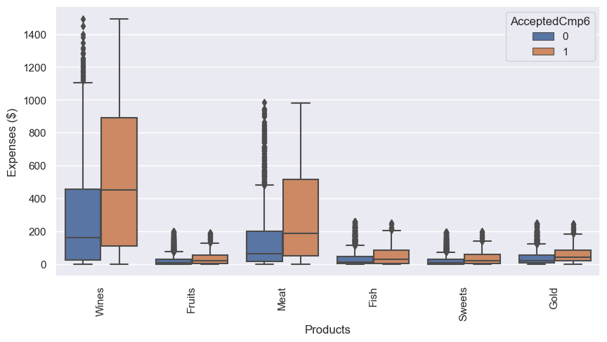
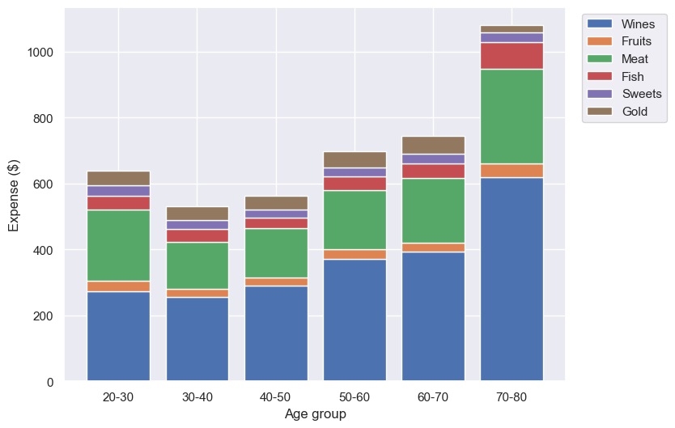
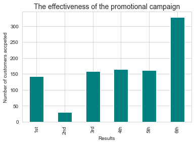
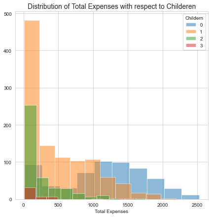
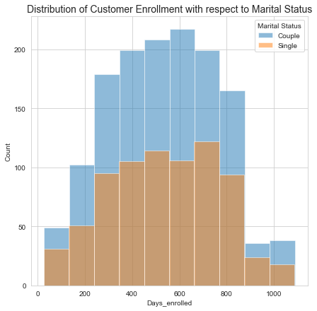
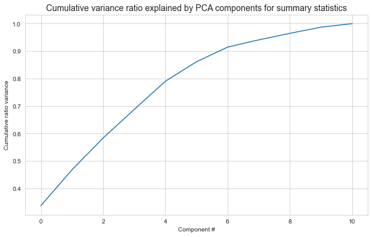
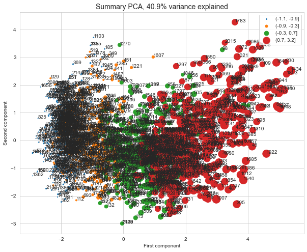
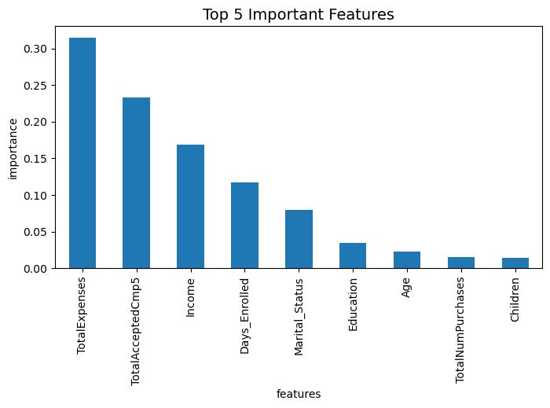

Predict customers' response to the marketing champaign
======================================================
  

# 1. Introduction

Customer personality analysis is an interesting topic for companies. The dataset is from a [public Kaggle competition](https://www.kaggle.com/datasets/imakash3011/customer-personality-analysis) and was collected between 2012 and 2014. To solve a binary classification problem, this notebook has trained five different machine learning models to learn this dataset, and predicted the customers’ response to the last 6th marketing campaign (accepting the offer or not) when we already have 5 campaigns.

The capstone project contains four parts: data cleaning, exploratory data analysis, preprocessing, final model selection and prediction. The data cleaning session includes filling in null values, removing less useful features, and organizing the categories within the features. A thorough EDA session includes visualization of bar plots and histograms to see the distribution of independent features and their relations to the dependent feature. The preprocessing session converts categorical varialbes into numeric variables using one-hot encode. In the last modeling session, different models are trained on the scaled train/test datasets with hyperparamter tuning, and evaluated based on ‘roc_auc” scores, and then the final model is selected and used to predict the customers’ response (yes/no).

# 2. Data Cleaning and Wrangling

  
  

# 3. Exploratory Data Analysis

  

**The total results of the marketing champaign from 1 to 6 in the data**
  
  
  

# 4. Preprocessing 
  

**The first two components account for about 47% of the variance, and the first five for over 80%.**   
  

The red points represent the upper quartile of 'TotalExpenses' and spread across the first dimension (>0). There's also a spread of the other quartiles as well. In this representation, the first two principal components explain about 47% of the variance exsiting in the data.  There appear separate groups in  the data.

# 5. Training and Modeling

 
|Models|ROC_AUC|
| :---: | :---: |
|LogisticRegression|0.8531198640887856|
|RandomForestClassifier|0.8528982697172824|
|KNeighborsClassifier|0.8089764186656325|
|GradientBoostingClassifier|0.821228740789984|
|XGBClassifier|0.827285653611065|

**Comparison of roc_auc scores between the models.**  

# 6. Summary and Further work

 - Five different supervised machine learning models are trained on the data. After comparing and evaluating the model performance, the final random forest model has an average accuracy of 0.88 and a strong roc_auc of 0.85 (consistent with cross validation roc of 0.83). Besides, the random forest model is fast to train, easy to tune and not prone to overfitting.
 - The analysis of customers' family structures, income and spending behaviors can help business understand how significant adding the last campaign is when they already have 5, better plan marketing strategies, boost new customer enrollment and potentially increase revenue. Further analysis about which features contribute most to customers' total expenses may generate more insights from the data.
 - If we would have more details/data about the campaigns, like their time spans, feed into the model training, we may get a more accuate model and better prediction for the effectiveness of the champaign.

[final slides](https://github.com/livia360/Capstone_project/blob/d30158857a59a9eb7c7ef6819aeef7d5e81b7cad/Capstone_Customer_Response_final_deck.pdf)
[final_report]()
