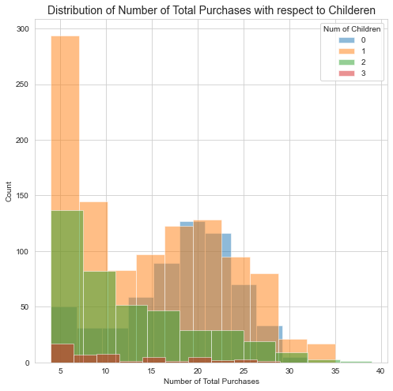
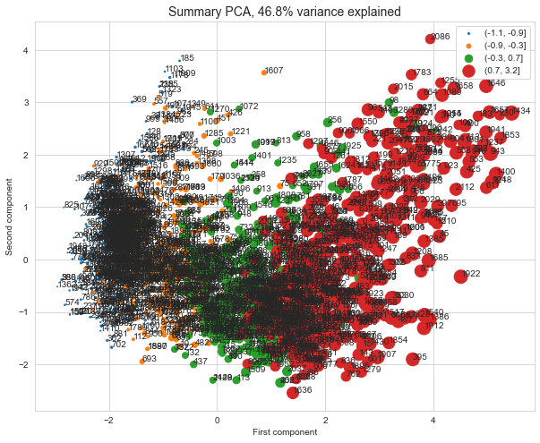

Predict customers' response to the marketing champaign
======================================================
  

# 1. Introduction

Customer personality analysis is an interesting topic for companies. The dataset is from a competition on Kaggle and collected between 2012 and 2014.
To practice and solve the binary classification problem, I have trained 5 machine learning models to this dataset to 
predict the customers’ response to the last 6th marketing campaign (accepting the offer or not) when we already have 5 campaigns, and identified the important 
influential features behind it.

The capstone project contains four parts: data cleaning, exploratory data analysis, preprocessing, final model selection
and prediction. The data cleaning includes filling in null values, removing less useful features, and organizing the 
categories within the features. EDA is using visualization tools, like bar plots and histograms to look at the 
distribution of independent features and their relations to the dependent feature. The preprocessing and training 
session split data into train/test datasets, trained and tuned 5 different machine learning models. In the last session,
select the best model based on the metric ‘roc_auc” score, refit the model using all available data and predict the 
customers’ response.

# 2. Data Cleaning and Wrangling

  
  

# 3. Exploratory Data Analysis

  

**The total results of the marketing champaign from 1 to 6 in the data**
  
  
  

**The first two components account for about 60% of the variance, and the first five for over 95%.**   
  

The red points represent the upper quartile of 'TotalExpenses' and spread across the first dimension. There's also a 
spread of the other quartiles as well. In this representation, the two principal components account for about 60% of the 
variance in the data.  

# 4. Preprocessing and Training
  

|Models|ROC_AUC|
| :---: | :---: |
|LogisticRegression|0.8531198640887856|
|RandomForestClassifier|0.8528982697172824|
|KNeighborsClassifier|0.8089764186656325|
|GradientBoostingClassifier|0.821228740789984|
|XGBClassifier|0.827285653611065|

# 5. Modeling

  

The final random forest model has average accuracy of 0.99 and a strong roc_auc of 0.85, and performs well on the unseen
 data. Besides, the random forest model is fast to train, easy to tune and not prone to overfitting.The analysis of 
customers' family structures, income and spending behaviors can help business better plan marketing strategies, boost 
new customer enrollment and potentially increase revenue. Further analysis about which features contribute most to customers' 
total expenses may generate more insights from the data.
